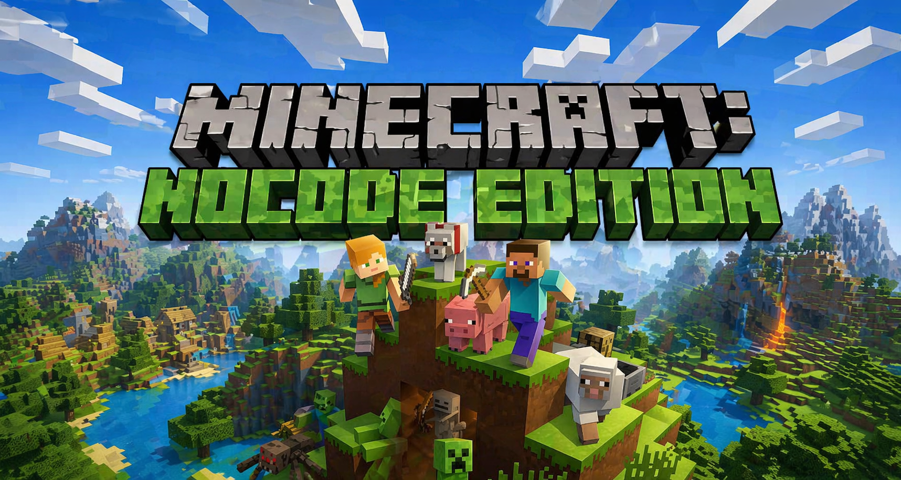

<div align="center">
  
</div>
<h3 align="center">Desarrollado para la materia: Programación Web Avanzada - UNCo</h3>

# 🧱 Minecraft NoCode Edition - Backend API

Esta es la API REST desarrollada con Node.js, Express, Prisma ORM y PostgreSQL (hosteada en Supabase) para dar soporte a la aplicación web "Minecraft NoCode Edition". Este proyecto permite persistir los datos reales de la aplicación y reemplazar el uso de `localStorage` en el frontend.

## 👥 Integrantes del Grupo
| Rol | Nombre | GitHub |
| :--- | :--- | :--- |
| PM / Scrum Master | Abril Gavilan | [@abrilgavilan11] |
| Backend Developer | Daniela Oñatibia | [@DanielaOnatibia] |
| Backend Developer | Erick Gonzalez | [@DevEriik] |


## 🔗 Enlaces del Proyecto
* **Repositorio Frontend:** https://github.com/DevEriik/MINECRAFT---NoCode-Edition
* **Repositorio Backend:** https://github.com/abrilgavilan11/MINECRAFT-NOCODE_EDITION
* **Tablero Kanban:** https://github.com/users/abrilgavilan11/projects/3
* **Deploy Frontend:** https://minecraft-nocode-edition.vercel.app/
* **Deploy Backend:** []

## 🎮 Descripción de la Aplicación
Minecraft NoCode Edition es una plataforma orientada a la comunidad técnica y creativa de Minecraft. Cuenta con herramientas como un creador de skins 2D y un directorio de ítems del juego, facilitando la gestión de recursos sin necesidad de programar.

### 📦 Entidades Elegidas
Las entidades principales modeladas para este CRUD son Skins e Items. Estas entidades contienen toda la información necesaria para gestionar el recurso y conectarlo con nuestra base de datos PostgreSQL, e incluye campos obligatorios como `id`, `createdAt` y `updatedAt`.

## ✨ Características Principales

* 🗄️ **Base de Datos Relacional:** Uso de PostgreSQL (Supabase) para persistencia real.
* 🏗️ **ORM Moderno:** Esquemas y migraciones gestionadas 100% con Prisma.
* 🛡️ **Validaciones Nativas:** Validación manual del body en endpoints POST y PUT.
* 🌐 **CORS Configurado:** Comunicación fluida y segura con el frontend.
* 🚀 **Arquitectura Limpia:** Separación de responsabilidades en controladores, servicios y rutas.

## 🛠️ Tecnologías Utilizadas

* Node.js
* Express
* Prisma ORM
* PostgreSQL (Supabase)

---

## 🛠️ Instrucciones de Instalación y Ejecución

Sigue estos pasos para correr el entorno de desarrollo localmente

1. Clonar este repositorio:
   ```bash
    git clone https://github.com/abrilgavilan11/MINECRAFT-NOCODE_EDITION.git
   ```

2. Instalar las dependencias:  
    ```bash
        npm install
    ```

3. Levantar el servidor en modo desarrollo:  
    ```bash
        npm run dev
    ```

4. Levantar el servidor en modo producción:  
    ```bash
        npm start
    ```

## ⚙️ Configuración de Variables de Entorno
El proyecto requiere variables de entorno para funcionar y conectarse a la base de datos PostgreSQL. 

1. Crea un archivo .env en la raíz del proyecto.
2. Copia la estructura del archivo .env.example proporcionado en este repositorio.
3. Solicita las credenciales reales (DATABASE_URL) por mensajería privada al equipo. No subas tus credenciales al repositorio.

## 🗄️ Base de Datos (Supabase): Migraciones y Seed
Este proyecto utiliza Prisma ORM para el modelado y la conexión con la base de datos alojada en Supabase. Para inicializar la base de datos remota con la estructura y los datos, ejecuta los siguientes comandos:

1. Ejecutar las migraciones:

```bash
    npx prisma migrate dev
```

2. Ejecutar el seed:
Esto poblará la base de datos de Supabase con un set de datos iniciales de prueba.

```bash
    npx prisma db seed
```
